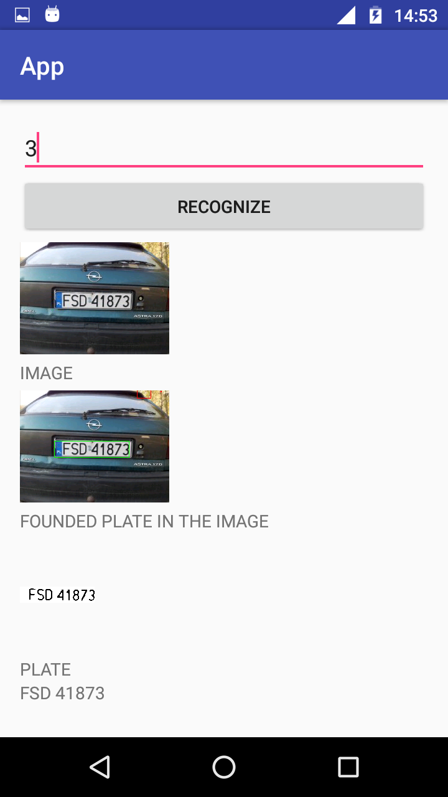
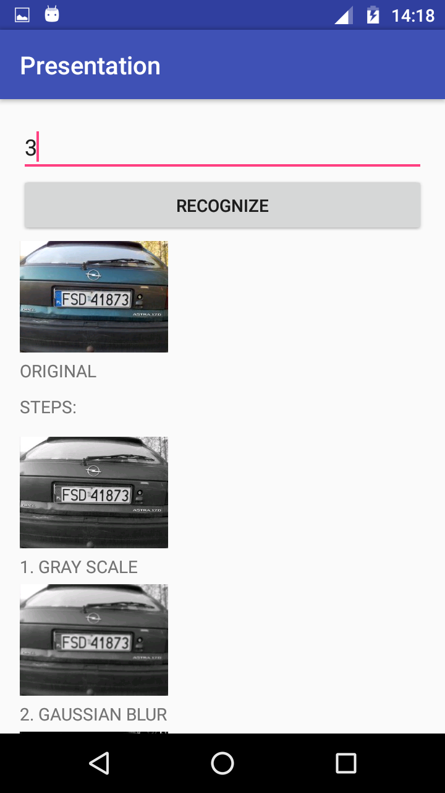
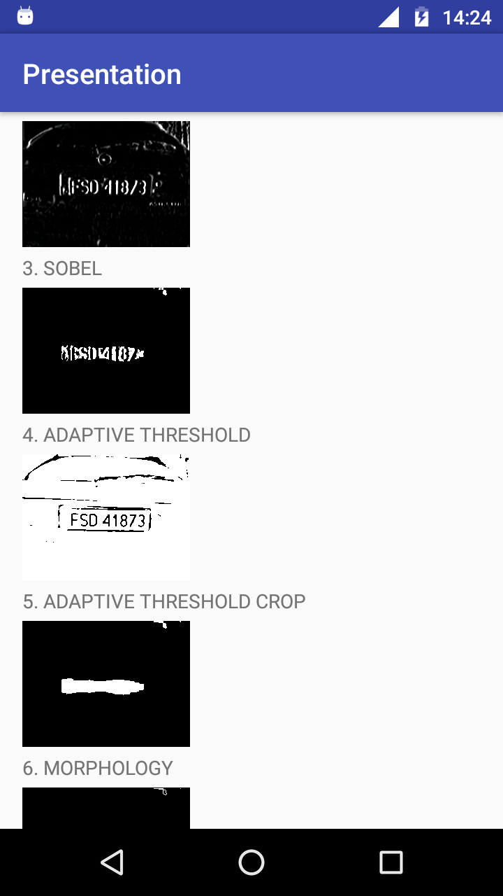
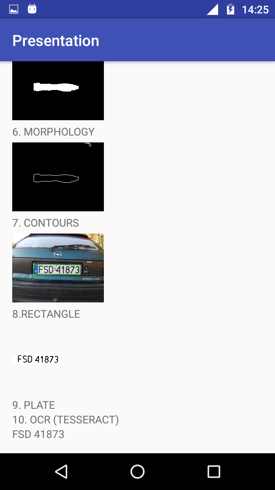
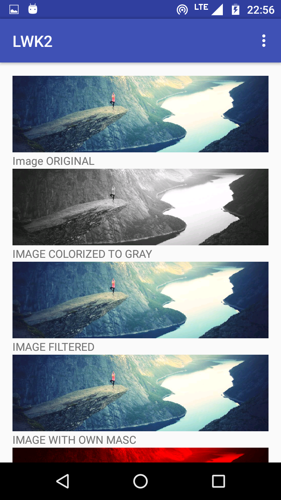
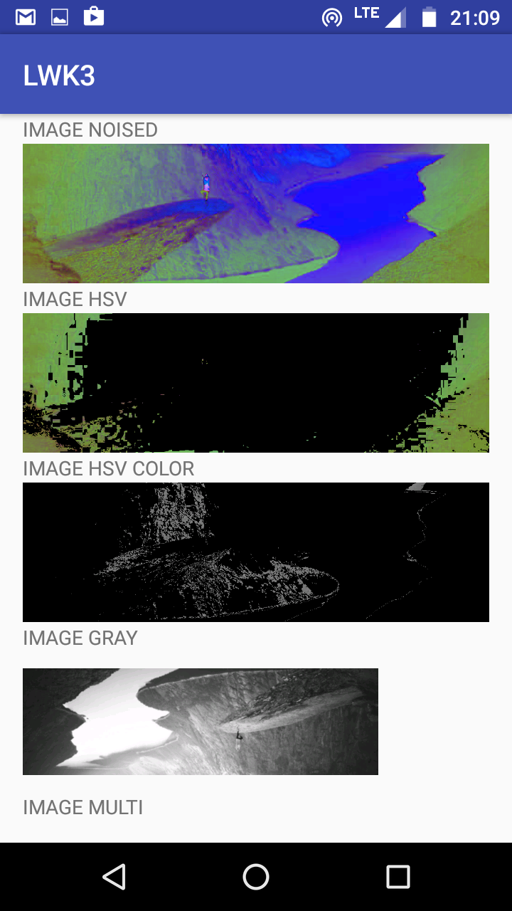
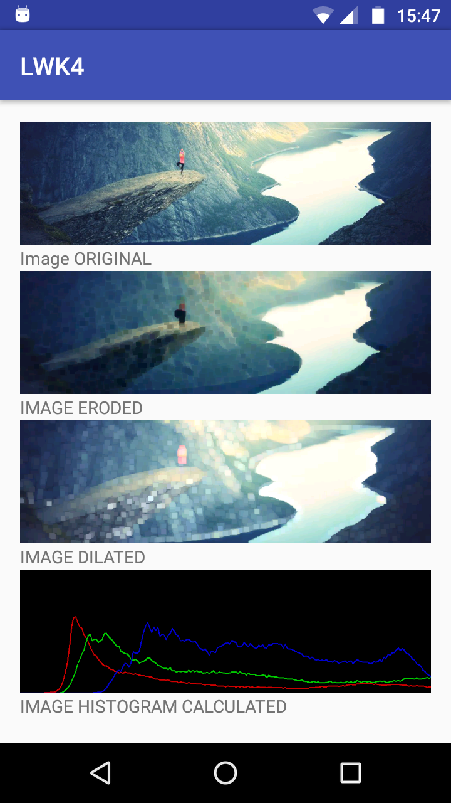

# CV-Plate-Recognition
Computer Vision Plate Recognition App and other examples in OpenCV for Android. Created at the Univeristy as the project within Computer Vision classes in 2016. The purpose of this project and those examples was to learn computer vision techniques using OpenCV.

## Plate Recognition
The App recognizes vehicle plate in EU standard. App loads photo by name from phone storage and recognizes plate.

### Screenshots
Screenshots examples. For more see [images/Presentation](images/Presentation) folder.

   

### How it is doing?
1. Looking for a potential array in the image
2. Cut out the potential tables
3. Read the text from the table

#### Looking for a potential array in the image
1. Load the original ones
2. Grayscale
3. Gaussian blur
4. Edge sharpening / relief (SOBEL)
5. Adaptation of the threshold (OTSU + BINARY)
6. Morphological transformation (MORPH_CLOSE - dokmnięcie)
7. Drawing contours

#### Cutting out potential boards
1. Check whether the contour meets the assumptions as to the size and the ratio of width to height
2. From the previous step 3, Gaussian Blur - Adaptation of the threshold (GAUSSIAN_C + BINARY_INV)
3. We check whether the completion of the accepted contour meets the assumptions as to the ratio of white color
4. We accept as an array and make a notch from step no

#### From Tesserax
- training set
- setting for accepted characters: uppercase letters and numbers

## Examples
LWK2, LWK3 and LWK4 are simple examples which show computer vision techniques in OpenCV.

### Screenshots
Screenshots examples. For more see [images](images) folder.

  
